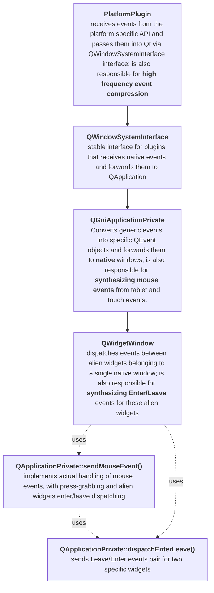

# On input handling in Qt

## Overview

Handling of input events in Qt is split into four main stages. At the first three stages, Qt operates with "native" events, i.e. the events that target real existing native surfaces. And only at the last stage (`QWidgetWindow`) these events are split between (Qt's internal) alien widgets.

## Stage 1. Platform plugin

A platform plugin is responsible to receive the input events from the platform-specific API and pass them to Qt via a special stable interface `QWindowSystemInterface`.

At this level, all events are targeted to native windows (or surfaces) only. The platform plugin knows nothing about internal Qt's alien widgets.

> [!NOTE]
> From the practical point of view, it means that Enter/Leave events generated by the platform plugin are generated only when the cursor transitions between two native windows (or surfaces). The transitions between alien widgets are handled much later, at the level of `QWidgetWindow`

If the client activated high-frequency events compression via `Qt::AA_CompressHighFrequencyEvents` or `Qt::AA_CompressTabletEvents`, the plugin will also handle that by dropping input events that stacked up in the platform-specific (not QApplication's!) events queue.

### Windows-specific details

On Windows input events are handled in:

* mouse events are handled via the legacy mouse events (not via Windows Pointer API) in `QWindowsPointerHandler::translateMouseEvent()`
* touch events are always handled by Windows Pointer API (WinInk) in `QWindowsPointerHandler::translateTouchEvent()`
* tablet events can be processed using two different APIs, depending on the option set with `QWindowsApplication::setWinTabEnabled()`:
    * Windows Pointer API: `QWindowsPointerHandler::translatePenEvent()`
    * WinTab: `QWindowsTabletSupport::translateTabletPacketEvent()`

There are several important quirks in Windows Pointer API:

1) Windows Pointer API has a concept of a ["processed message"](https://learn.microsoft.com/en-us/windows/win32/inputmsg/wm-pointerdown#return-value). If the application does not process (i.e. ignores) a tablet or a touch event, then the OS will (potentially) start a global gesture. For example, a long press with a stylus will start a "right-button-mouse-click" gesture. To inhibit such gestures, the application should explicitly consume such messages. In Qt it is done by returning `true` from `translatePenEvent()` or `translateTouchEvent()`.

   Windows Pointer API is the only platform which has such a concept. Even WinTab doesn't have it.

2) Since Windows Pointer API requires the message handler to know the result of the event processing, all input events originating from Windows Pointer API are delivered **synchronously** (`QWindowSystemInterface::SynchronousDelivery`). On other platforms input events are delivered asynchronously, i.e. via the `QApplication`'s event queue.

3) There is a quirk in Windows Pointer API. If an application consumes a tablet event, then OS will **not** update the hardware cursor position. Therefore we have a special code to move the cursor for consumed tablet events. It explicitly calls `SetCursorPos()` and `SendInput()` WinAPI functions.

> [!IMPORTANT] The fixes for all these Windows Pointer API quirks are **not** present in the upstream version of Qt. These patches are Krita-only.

### Wayland-specific details

On Wayland input events are handled in:

* mouse, touch and touchpad (gesture) events are handled in `QWaylandInputDevice`
* tablet events are handled in `QWaylandTabletToolV2`

There are several important quirks in Wayland input API:

1) Each input device and each pen of each tablet device can theoretically have its own physical cursor (in different positions). Usually, window manager just remembers the position of each input device (and pen) and jumps the single hardware cursor into its remembered position when the device becomes active.

2) Wayland API has no separate `ProximityEnter`/`ProximityLeave` events for tablet devices. Instead, Wayland just notifies the app when a pen enters or leaves the region of the surface. It is impossible to distinguish whether the pen was lifted up or just moved to a different surface. From the practical point of view, it means that Qt just sends a pair of `ProximityEnter`+`Enter` every time a stylus enters the surface (whatever actual reason for this entry is).

   > [!NOTE] A pair of `ProximityEnter`+`Enter` events is delivered only when the pointer enters a **native** widget. If the widget is alien, then it will receive a normal `Enter` only.

3) According to Wayland API each input device and each pen of each tablet should have its own cursor. And its cursor should be set up by the client manually every time the input device enters a surface. That leads to a little bit complicated code in Qt, because it Qt cursors are associated with widgets, not with input devices. And widgets may be alien, i.e. platform plugin knows nothing about them. That makes the things even more complicated. See `QWaylandWindow::applyCursor()` for details.

> [!IMPORTANT] The fixes for all these Wayland quirks are **not** present in the upstream version of Qt. These patches are Krita-only.

## Stage 2. QWindowSystemInterface

`QWindowSystemInterface` is a special class that provides a stable API for platform plugins to pass platform-generated events to `QApplication`. The main purpose of this class is to be stable and (sometimes) decide whether an event should be delivered _synchronously_ or _asynchronously_.

## Stage 3. QGuiApplicationPrivate

After leaving `QWindowSystemInterface` an event is delivered to `QGuiApplicationPrivate`. It has two main purposes:

1) Convert an event from a Qt-private platform-specific event (e.g. `QWindowSystemInterfacePrivate::TabletEvent `) into a Qt-public user-visible event (e.g. `QTabletEvent`).

2) Synthesize mouse events from ignored tablet and touch events if requested:
   * if platform doesn't do that automatically. See `QWindowSystemInterfacePrivate::TabletEvent::platformSynthesizesMouse`.
     > [!NOTE] WinTab is the only platform that synthesizes mouse events at the system level
   * if application attributes require that (both are enabled by default):
     * `Qt::AA_SynthesizeMouseForUnhandledTabletEvents`
     * `Qt::AA_SynthesizeMouseForUnhandledTouchEvents`

All the processing happens in the following functions:

* `QGuiApplicationPrivate::processMouseEvent()`
* `QGuiApplicationPrivate::processTabletEvent()`
* `QGuiApplicationPrivate::processTouchEvent()`
* `QGuiApplicationPrivate::processEnterEvent()`
* `QGuiApplicationPrivate::processLeaveEvent()`

Up to this stage, all the events are targeted to **native windows** only! It means that the events generated in `processEnterEvent()` and `processLeaveEvent()` are not yet ready to be delivered to actual widgets. They should be first delivered to some `QWindow` object (which is usually an instance of `QWidgetWindow`), which will then dispatch them to actual _alien_ widgets.

## Stage 4. QWidgetWindow

`QWidgetWindow` performs the final processing of an input event. It performs several things:

1) Finds an actual _alien_ widget which should receive this input event
2) Checks if the cursor moved from one alien widget to another and `Enter`/`Leave` events should be **synthesized**.
   > [!WARNING] Qt expects the system to have only one physical cursor. It stores the "currently hovered widget" in a static global variable `qt_last_mouse_receiver`, which goes in conflict with Wayland's multi-cursor design.
3) Implements "pointer grabbing". I.e. if the user presses the mouse (or tablet) button on a widget, then all the events until the next button-release event will be delivered to this widget. See `qt_button_down` and `qt_tablet_target` global variables.

All the processing happens in the following functions:

* `QWidgetWindow::handleMouseEvent()`
   * uses `QApplicationPrivate::sendMouseEvent()` to actually send the mouse event with proper handling of Enter/Leave events
* `QWidgetWindow::handleTabletEvent()`
   * uses `QApplicationPrivate::dispatchEnterLeave()` to manually dispatch `Enter`/`Leave` events in case the tablet event was consumed and the following mouse event that would normally dispatch `Enter`/`Leave` events will not arrive
     > [!IMPORTANT] This fix is **not** present in the upstream version of Qt, this patch is Krita-only.
* `QWidgetWindow::handleTouchEvent()`
* `QWidgetWindow::handleEnterLeaveEvent()`
   * converts platform-generated `Enter`/`Leave` events for native window into the ones for alien widgets and delivers them via `QApplicationPrivate::dispatchEnterLeave()`